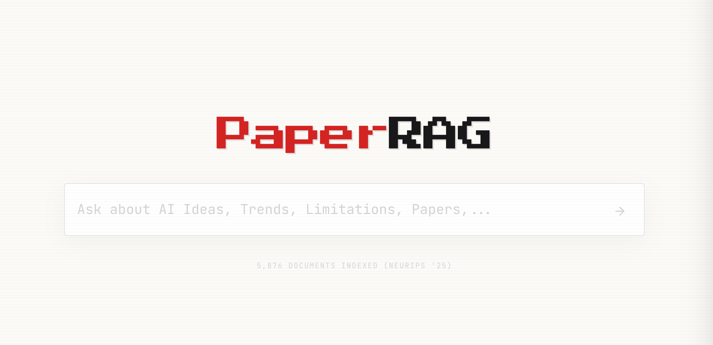
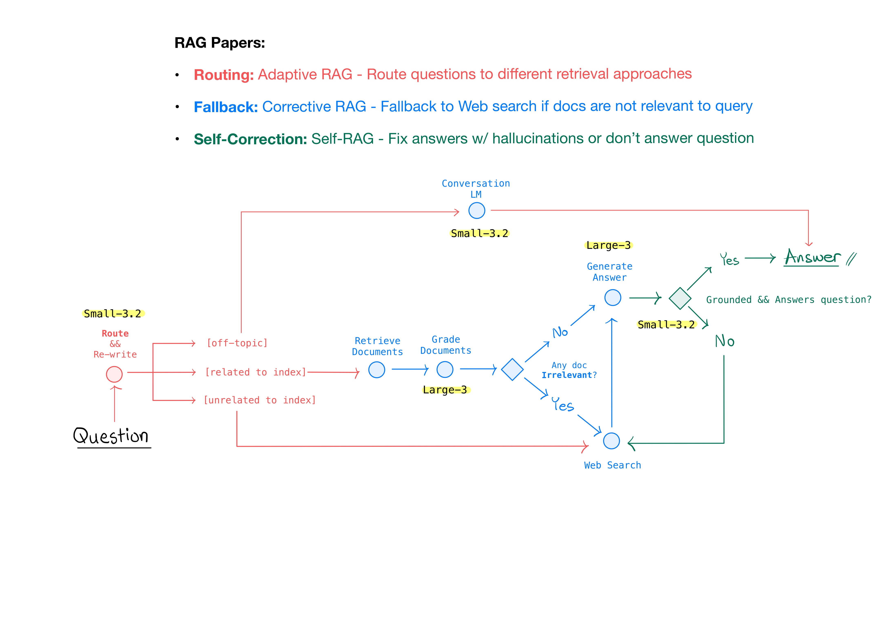
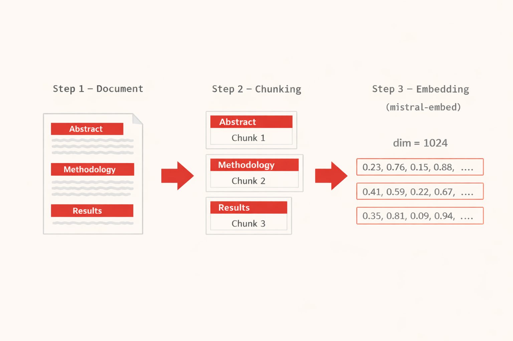

<p align="center">
  
</p>

<p align="center">
  <strong>A RAG system to explore research papers in AI</strong>
</p>

<p align="center">
  
  
  
  
</p>

<p align="center">
  
  
  
  
  
</p>

<p align="center">
  <a href="#overview">Overview</a> •
  <a href="#rag-flow">RAG Flow</a> •
  <a href="#chunk_&_embed">Chunk & Embed </a> •
  <a href="#tech-stack">Tech Stack</a>
</p>

---

## Overview

PaperRAG is a production-ready Retrieval-Augmented Generation (RAG) system that enables conversational exploration of ~6,000 NeurIPS 2025 research papers. 

It is built upon an **agentic RAG workflow**, combining  Adaptive RAG ([paper](https://arxiv.org/pdf/2403.14403)), Corrective RAG ([paper](https://arxiv.org/pdf/2401.15884)), and Self-RAG ([paper](https://arxiv.org/pdf/2310.11511)). The system is orchestrated by LangGraph.

Powered by **Mistral models** (Mistral Large, Mistral Small 3.2, Ministral 3B, Mistral Embed), Cohere (Re-ranker) and Tavily (Web-search).

## RAG Flow

<p>
  
</p>

## Features

- **Streaming Responses** — Real-time token streaming via Server-Sent Events (SSE)
- **Structured Citations** — Click-to-inspect source cards with relevance scores
- **Intelligent Routing** — Automatic classification of query intent
- **Hybrid Search** — Best of semantic understanding + keyword matching
- **Corrective RAG** — Self-healing pipeline with fallback strategies
- **Latency Tracking** — Per-step timing metrics in the RAG console

## Chunk & Embed
<p>
  
</p>


## Tech Stack

### Backend
| Component | Technology |
|-----------|------------|
| Framework | FastAPI |
| Streaming | SSE (sse-starlette) |
| Orchestration | LangGraph |
| Vector DB | Pinecone (hybrid sparse-dense) |
| Embeddings | Mistral Embed |
| Reranking | Cohere Rerank v3.5 |
| LLMs | Mistral Large, Mistral Small, Ministral 3B |
| Sessions | Redis |
| Web Search | Tavily |

### Frontend
| Component | Technology |
|-----------|------------|
| Framework | Next.js 14 (App Router) |
| Styling | Tailwind CSS |
| Components | shadcn/ui |
| Fonts | JetBrains Mono, Press Start 2P |
| Streaming | EventSource API |
| Markdown | react-markdown |


## Project Structure

```
la-route/
├── crag/                    # Backend package
│   ├── api.py               # FastAPI endpoints
│   ├── streaming.py         # SSE streaming pipeline
│   ├── graders.py           # Router, rewriter, graders
│   ├── retrieval.py         # Pinecone hybrid retriever
│   ├── citations.py         # Citation extraction
│   ├── session.py           # Session management
│   ├── config.py            # Model configurations
│   └── graph.py             # LangGraph workflow
├── frontend/                # Next.js frontend
│   ├── src/
│   │   ├── app/             # Next.js app router
│   │   ├── components/      # React components
│   │   ├── hooks/           # Custom hooks (useChat)
│   │   └── lib/             # API client
├── public/                  # Static assets
├── requirements.txt         # Python dependencies
├── Procfile                 # Railway start command
└── README.md
```

## License

MIT License - see [LICENSE](LICENSE) for details.
