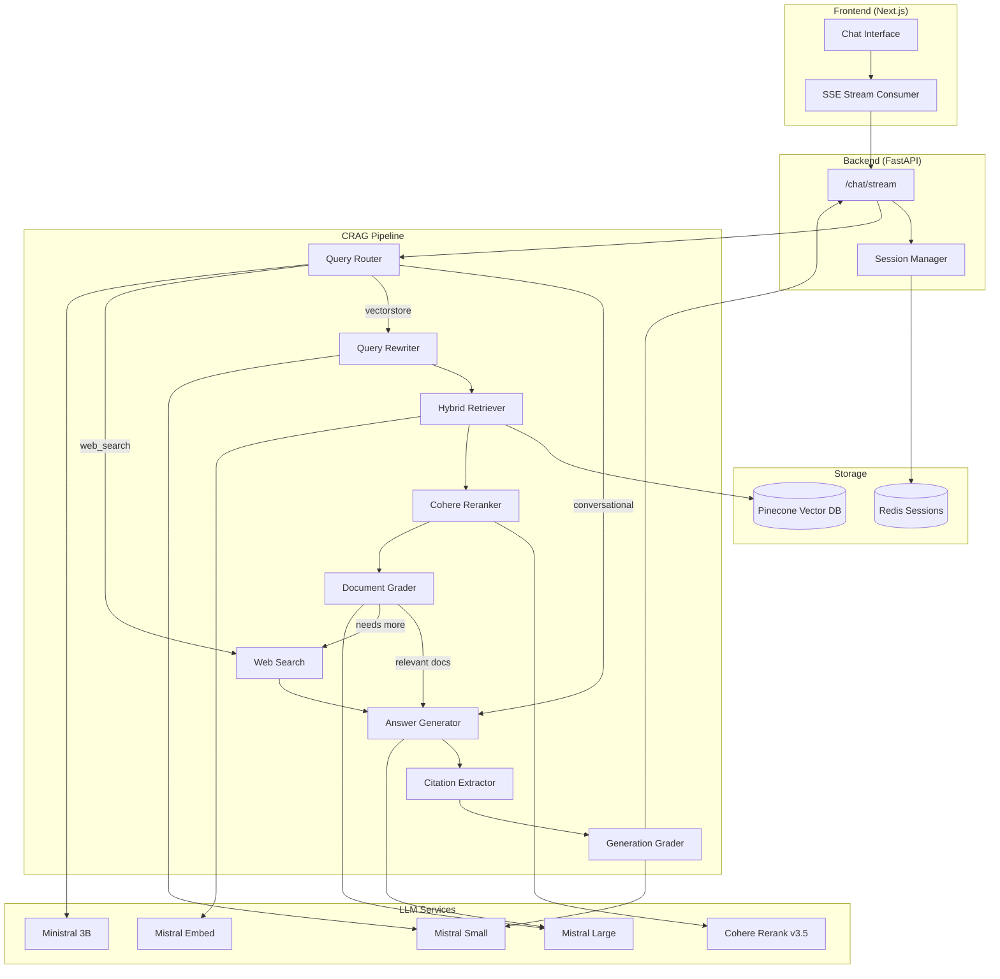

<p align="center">
  
</p>

<h1 align="center">PaperRAG</h1>

<p align="center">
  <strong>A Corrective RAG System for NeurIPS 2025 Research Papers</strong>
</p>

<p align="center">
  <a href="#architecture">Architecture</a> •
  <a href="#features">Features</a> •
  <a href="#tech-stack">Tech Stack</a> •
  <a href="#getting-started">Getting Started</a> •
  <a href="#deployment">Deployment</a>
</p>

---

## Overview

PaperRAG is a production-ready Retrieval-Augmented Generation (RAG) system that enables conversational exploration of ~6,000 NeurIPS 2025 research papers. It implements a **Corrective RAG (CRAG)** architecture with intelligent query routing, hybrid search, document grading, and structured citations.

## Architecture



### Pipeline Flow

1. **Query Routing** — Classifies queries into three paths:
   - `conversational`: Greetings, off-topic → Direct LLM response
   - `vectorstore`: Research questions → Full RAG pipeline
   - `web_search`: Current events → Web search fallback

2. **Query Rewriting** — Transforms follow-up questions into standalone search queries using conversation history

3. **Hybrid Retrieval** — Combines semantic (dense) and keyword (BM25 sparse) search via Pinecone

4. **Reranking** — Cohere Rerank v3.5 reorders documents by relevance

5. **Document Grading** — LLM evaluates each document's relevance; triggers web search if insufficient

6. **Answer Generation** — Streams response with inline citations `[1]`, `[2]`, etc.

7. **Citation Extraction** — Parses structured citation metadata from LLM output

8. **Generation Grading** — Validates answer for grounding (hallucination check) and usefulness

## Features

- **Streaming Responses** — Real-time token streaming via Server-Sent Events (SSE)
- **Structured Citations** — Click-to-inspect source cards with relevance scores
- **Session Memory** — Multi-turn conversations with Redis-backed persistence
- **Intelligent Routing** — Automatic classification of query intent
- **Hybrid Search** — Best of semantic understanding + keyword matching
- **Corrective RAG** — Self-healing pipeline with fallback strategies
- **Latency Tracking** — Per-step timing metrics in the RAG console

## Tech Stack

### Backend
| Component | Technology |
|-----------|------------|
| Framework | FastAPI |
| Streaming | SSE (sse-starlette) |
| Orchestration | LangGraph |
| Vector DB | Pinecone (hybrid sparse-dense) |
| Embeddings | Mistral Embed |
| Reranking | Cohere Rerank v3.5 |
| LLMs | Mistral Large, Mistral Small, Ministral 3B |
| Sessions | Redis |
| Web Search | Tavily |

### Frontend
| Component | Technology |
|-----------|------------|
| Framework | Next.js 14 (App Router) |
| Styling | Tailwind CSS |
| Components | shadcn/ui |
| Fonts | JetBrains Mono, Press Start 2P |
| Streaming | EventSource API |
| Markdown | react-markdown |

## Getting Started

### Prerequisites

- Python 3.11+
- Node.js 18+
- API Keys: Mistral, Pinecone, Cohere, Tavily (optional)

### Backend Setup

```bash
# Clone and enter directory
cd la-route

# Create virtual environment
python -m venv venv
source venv/bin/activate  # or `venv\Scripts\activate` on Windows

# Install dependencies
pip install -r requirements.txt

# Set environment variables
cp .env.example .env
# Edit .env with your API keys

# Run the server
uvicorn crag.api:app --reload --port 8000
```

### Frontend Setup

```bash
cd frontend

# Install dependencies
npm install

# Set environment variable
echo "NEXT_PUBLIC_API_URL=http://localhost:8000" > .env.local

# Run development server
npm run dev
```

Open [http://localhost:3000](http://localhost:3000) to start chatting.

## Environment Variables

### Backend (.env)
```
MISTRAL_API_KEY=your-mistral-key
PINECONE_API_KEY=your-pinecone-key
COHERE_API_KEY=your-cohere-key
TAVILY_API_KEY=your-tavily-key        # Optional
REDIS_URL=redis://localhost:6379       # Optional, for persistent sessions
CORS_ORIGINS=http://localhost:3000     # Comma-separated allowed origins
```

### Frontend (.env.local)
```
NEXT_PUBLIC_API_URL=http://localhost:8000
```

## Deployment

### Backend (Railway)

1. Push to GitHub
2. Connect repo to Railway
3. Set environment variables in Railway dashboard
4. Add Redis service and link `REDIS_URL`
5. Railway auto-deploys on push

### Frontend (Vercel)

1. Import repo to Vercel
2. Set root directory to `frontend`
3. Add `NEXT_PUBLIC_API_URL` pointing to Railway backend
4. Deploy

## Project Structure

```
la-route/
├── crag/                    # Backend package
│   ├── api.py               # FastAPI endpoints
│   ├── streaming.py         # SSE streaming pipeline
│   ├── graders.py           # Router, rewriter, graders
│   ├── retrieval.py         # Pinecone hybrid retriever
│   ├── citations.py         # Citation extraction
│   ├── session.py           # Session management
│   ├── config.py            # Model configurations
│   └── graph.py             # LangGraph workflow
├── frontend/                # Next.js frontend
│   ├── src/
│   │   ├── app/             # Next.js app router
│   │   ├── components/      # React components
│   │   ├── hooks/           # Custom hooks (useChat)
│   │   └── lib/             # API client
├── public/                  # Static assets
├── requirements.txt         # Python dependencies
├── Procfile                 # Railway start command
└── README.md
```

## License

MIT License - see [LICENSE](LICENSE) for details.
